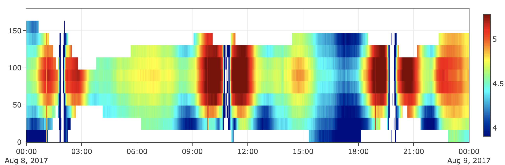
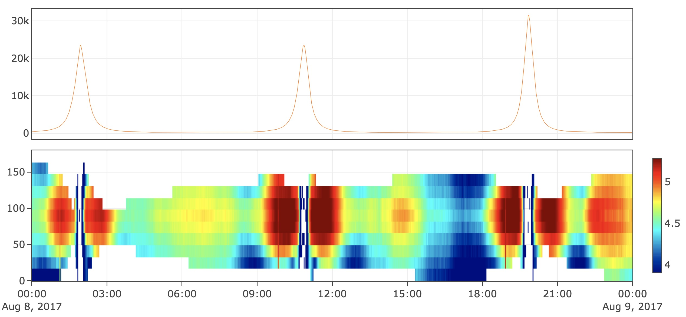

快速入门
================================

笨笨是一名空间物理专业的研究生，他很认真，但是很笨。最近导师给了他一些画图任务，本以为要过一个星期才能得到结果，没想到十分钟笨笨就画好了！Σ( ° △ °|||)︴
我们来看看笨笨是如何实现的吧！

画出磁场的变化
--------------------------------
导师给了笨笨一个cdf文件，要求他把里面的磁场数据读出并画出线图。

.. code-block:: python

    from spacepku import *
    Data = cdf_obj('mentor_data.cdf')
    fig_B = Data.tplot('B_Calc')

.. figure:: ./figs/quick_start_fig1.png
   :align: center

只需要三行就把图画完了诶，Amazing！我们仔细看看这三行都做了什么吧！

第一步将spacepku导入

.. code-block:: python

    from spacepku import *

第二步读取导师给笨笨的cdf文件

.. code-block:: python

    Data = cdf_obj('mentor_data.cdf')

第三步指定画出Data中名字为B_Calc的变量，这里tplot的含义是 *time series plot*
（fig_B是这张图的句柄）

.. code-block:: python

    fig_B = Data.tplot('B_Calc')

画出某能量电子的投掷角分布变化
--------------------------------
继续向前，笨笨要画张横轴是时间，纵轴是电子投掷角，用颜色表示电子通量的Heatmap。

首先我们看看Data里面都有什么，直接将刚刚得到的变量Data打印出来

.. code-block:: python

    print(Data)

cdf data object generated from:

/data/mentor_data.cdf

0 Epoch (7825,)

1 FEDU_Alpha (11,)

2 FEDU_Energy (7825, 25)

3 FEDU (7825, 11, 25)

4 L (7825,)

5 B_Calc (7825,)

6 MLT (7825,)

7 Position (7825, 3)

笨笨只需要做两件事

#. 取出时间，投掷角和FEDU
#. 生成一个tplot_heatmap_obj并使用.tplot画出

.. code-block:: python

    time = Data['Epoch']
    pa = Data['FEDU_Alpha']
    fedu = Data['FEDU'][:, :, 0] #取出第1个能段的FEDU
    fig_fedu = tplot_heatmap_obj(time, pa, fedu).tplot()

是不是非常便捷！这两种图已经可以覆盖笨笨的大部分科研任务了，只花了不到五分钟诶

将多张图叠在一起
--------------------------------
最后导师需要把刚才的两张图作为两个panel堆叠起来，这一任务只需要一行命令

.. code-block:: python

    fig_final = stack_figs([fig_fedu, fig_B])

这两个panel共享同一个x轴

图片的保存与读取
--------------------------------
笨笨圆满完成了任务，他开心地把图片保存成png发给导师。执行了下面这条命令后，同目录下便得到了fig_final.png

.. code-block:: python

    save_png(fig_final, 'fig_final')

为了方便以后改图，笨笨又把这张图的源数据保存了下来

.. code-block:: python

    save_fig(fig_final, 'fig_final.fig')

读取图片源数据，并使用show函数显示它

.. code-block:: python

    fig_reload = load_fig('fig_final.fig')
    show(fig_reload)

